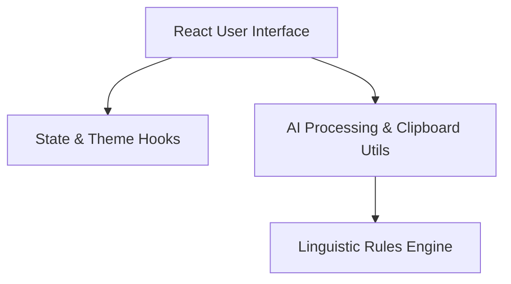
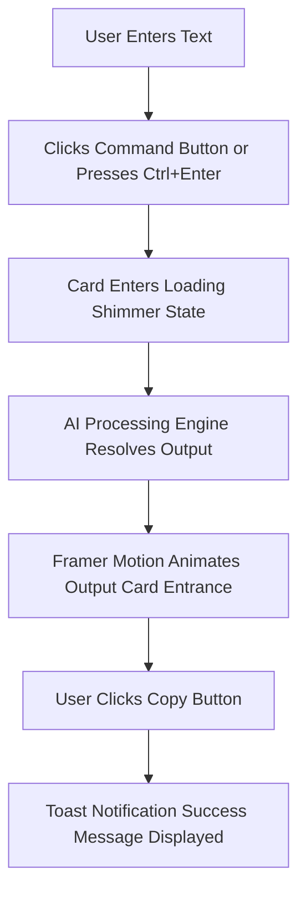
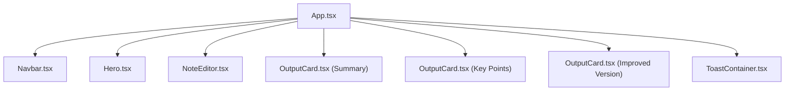
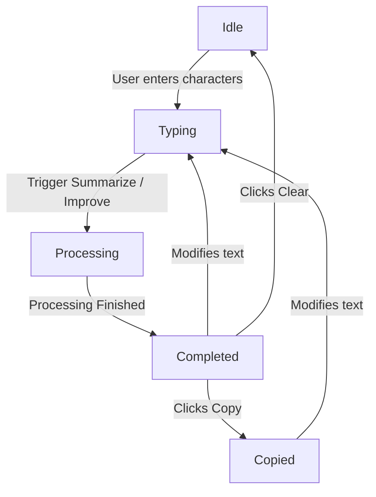
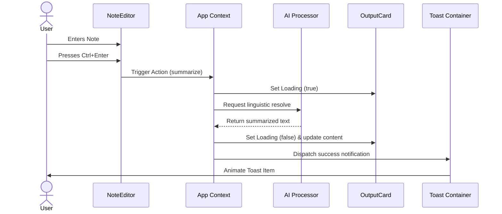
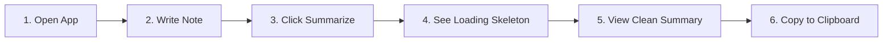
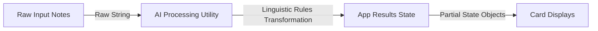

# <p align="center"> SmartNotes AI</p>

<p align="center">
  <strong>Write. Summarize. Improve. Everything powered by client-side note intelligence.</strong>
</p>

<p align="center">
  
  
  
  
  
  
  
</p>

<p align="center">
  <a href="https://smartnotes-nu.vercel.app/" target="_blank"><strong>⚡ Try the Live Demo →</strong></a>
</p>

---

## 📋 Table of Contents
- [🔍 Overview](#-overview)
- [⚡ Features](#-features)
- [🏗️ System Architecture & Diagrams](#-system-architecture--diagrams)
  - [Architecture Diagram](#architecture-diagram)
  - [Application Workflow](#application-workflow)
  - [Component Hierarchy](#component-hierarchy)
  - [State Diagram](#state-diagram)
  - [Sequence Diagram](#sequence-diagram)
  - [User Journey](#user-journey)
  - [Data Flow Diagram](#data-flow-diagram)
- [📂 Folder Structure](#-folder-structure)
- [💻 Technology Stack](#-technology-stack)
- [🚀 Performance Optimizations](#-performance-optimizations)
- [♿ Accessibility](#-accessibility)
- [⚙️ Installation & Development](#-installation--development)
- [🗺️ Future Roadmap](#-future-roadmap)
- [🤝 Contributing](#-contributing)
- [📄 License](#-license)
- [💖 Acknowledgements](#-acknowledgements)

---

## 🔍 Overview
**SmartNotes AI** is an ultra-minimalist, high-performance web-based helper application that empowers creators, students, and engineers to clean, organize, and refine raw text content instantly.

Designed with inspiration from premium tools like **Linear**, **Vercel**, and **Notion AI**, SmartNotes AI works entirely local-first, allowing users to:
- Instantly capture thoughts inside an auto-resizing text editor.
- Summarize long text blocks using advanced client-side linguistic helpers.
- Extract clear, action-oriented bulleted key points.
- Automatically polish grammar, tone, and formatting for a professional appearance.

---

## ⚡ Features

| Feature | Description | Status |
| :--- | :--- | :---: |
| **AI Summarization** | Condenses paragraphs into core, readable takeaway messages. | ✅ |
| **Key Point Extraction** | Automatically converts unstructured text into clean numbered items. | ✅ |
| **Writing Improvement** | Professional phrasing upgrade, syntax normalization, and typo corrections. | ✅ |
| **Keyboard Friendly** | Complete support for shortcut combinations (`Ctrl+Enter` to Summarize). | ✅ |
| **Framer Motion Micro-Interactions** | 60FPS spring actions, scale events, and list layouts. | ✅ |
| **Copy & Clipboard Indicator** | One-click copy handler with a green feedback success icon. | ✅ |
| **Dark & Light Mode** | Smooth state changes leveraging Tailwind custom CSS variables. | ✅ |

---


## 🏗️ System Architecture & Diagrams

### Architecture Diagram
Describes how the user interface components communicate with local business logic modules.



### Application Workflow
Illustrates the user interactions and operational sequence.



### Component Hierarchy
The UI Component tree structure inside the single-page application.



### State Diagram
Defines the lifecycle state machine of the editor.



### Sequence Diagram
Sequence of interactions when triggering an action.



### User Journey
User goals and actions step by step.



### Data Flow Diagram
Tracks textual data mutation throughout the app.



---

## 📂 Folder Structure

```
src/
 ├── components/
 │    ├── Hero.tsx            # Decorative grid CSS illustration & header text
 │    ├── Navbar.tsx          # Branding & Light/Dark toggler
 │    ├── NoteEditor.tsx      # Main inputs, counters & buttons
 │    ├── OutputCard.tsx      # Card renderer with spring transitions & skeletons
 │    └── ToastContainer.tsx  # Dynamic Framer Motion toast list
 ├── hooks/
 │    ├── useTheme.ts         # Dark Mode class manager & LocalStorage
 │    └── useToast.ts         # Toast event notifier dispatcher
 ├── utils/
 │    ├── aiProcessor.ts      # Summary & polishing logic
 │    └── clipboard.ts        # Safe Clipboard APIs & counter utilities
 ├── App.tsx                  # Main state container & orchestrator
 ├── index.css                # Tailwind base, variables & CSS illustration design
 └── main.tsx                 # Client app compiler mounting point
```

---

## 💻 Technology Stack

| Technology | Purpose | Version |
| :--- | :--- | :--- |
| **React** | Reactive component state & UI engine. | `^19.2.7` |
| **TypeScript** | Strict compile-time checks and interface safety. | `~6.0.2` |
| **Tailwind CSS** | Styling using native variables and utility utilities. | `^4.3.3` |
| **Framer Motion** | GPU-accelerated spring animations and list enters. | `^11.x` |
| **Lucide React** | Premium quality, clean line icons. | `^0.x` |
| **Vite** | Modern, lightning-fast bundler server. | `^8.1.1` |

---

## 🚀 Performance Optimizations
- **No Cumulative Layout Shift (CLS)**: Output cards have fixed spring dimensions and loading layouts so text loading does not cause page layout jumps.
- **GPU Accelerated Rendering**: All transition paths (`Framer Motion` elements) use properties that are processed directly on the GPU (`transform` and `opacity`) rather than properties that trigger layout re-paints (`width`, `height`, or `margin`).
- **No Heavy External Images**: The hero illustration runs purely on HTML layout nodes combined with standard CSS variables.

---

## ♿ Accessibility
- **Semantic Tags**: Includes descriptive landmarks (`<header>`, `<main>`, `<footer>`).
- **Tab Focus Rings**: Outlines explicitly configured using focus variables.
- **Keyboard Shortcuts**: Key handlers mapped inside the textarea trigger summary creation seamlessly.

---

## ⚙️ Installation & Development

### 1. Clone the project
```bash
git clone <repository-url>
cd smart-notes
```

### 2. Install dependencies
```bash
npm install
```

### 3. Run dev server
```bash
npm run dev
```

### 4. Build for production
```bash
npm run build
```

---

## Live URL: [https://smartnotes-nu.vercel.app/](https://smartnotes-nu.vercel.app/)

---
## 🗺️ Future Roadmap
- [ ] **PDF & Text Upload**: Direct file drag-and-drop support.
- [ ] **Export Options**: Export summary results as Markdown, HTML, or JSON formats.
- [ ] **Speech-to-Text**: Voice input capabilities.
- [ ] **Multi-Language Support**: Summarize and translate between 10+ languages.

---

## 🤝 Contributing
Contributions are welcome! Please feel free to open a Pull Request with improvements, performance fixes, or UI components.

---

## 📄 License
Licensed under the [MIT License](LICENSE).

---

## 💖 Acknowledgements
- **Framer Motion** for bringing smooth transitions.
- **Lucide Icons** for the modern clean line icon sets.
- **Vercel** for optimal client hosting.
- **Google Build with AI Bootcamp** for inspiration.
